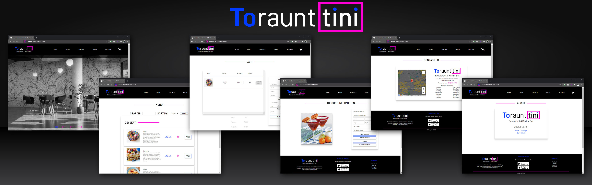

# Toraunttini Restuarant & Martini Bar

### Authors
[Brian Domingo](https://github.com/BrianJayD)

[Daryl Dyck](https://github.com/daryldyck/)
___

___
## About The Project
### Website Framework & CSS Design/Color Scheme
##### By Daryl Dyck
- Logo & FavIcon by Daryl Dyck
___
### Main Page
##### By Daryl Dyck

**Features include:**
- HTML / JavaScript (JQuery, Ajax)
- Slide Show (5 second delay - starts over when individual section is clicked)
- Feature section loaded dynamically from JSON
- Responsive design for mobile
___
### Menu Page
##### By Brian Domingo

**Features include:**
- 
___
### Cart Page
##### By Brian Domingo

**Features include:**
- Cart Qty updated in auth.js for each html file
___
### Contact Page
##### By Brian Domingo

**Features include:**
- 
___
### About Page
##### By Daryl Dyck

**Features include:**
- Website author info
- Responsive design for mobile
___
### Login/Account Page
##### By Daryl Dyck

**Features include:**
- HTML / JavaScript (JQuery)
- Login/Registration in slider view
- Users saved in localStorage
- Auth.js added to each html file to authenticate upon initial load.
- Responsive design for mobile
